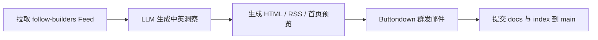

# 每日 AI 洞察

从 X、播客、官方博客等渠道筛选高价值 AI 构建者信息，整理为中英双语摘要，**每日一封邮件直达全文**——不用点外链读摘要。

---

# 订阅者指南

面向想**订阅、阅读、了解内容**的读者。维护仓库或自行部署请跳转到 [开发者指南](#开发者指南)。

## 订阅入口（推荐）

**首页订阅：** https://cherrylin000.github.io/AI-news/

打开页面后，滚动至底部 **「📬 邮件订阅」**，输入邮箱并点击「订阅」即可。

### 订阅后请完成邮件验证

1. 查收确认邮件（由 [Buttondown](https://buttondown.com) 发送）
2. 点击邮件中的确认链接，完成双重验证
3. 若几分钟内未收到，请先查看**垃圾箱**，并将发件人标记为「**非垃圾邮件**」，以免错过后续每日推送

验证成功后，你将每日收到完整 HTML 正文邮件。

## 其他阅读方式

| 方式 | 链接 | 说明 |
|------|------|------|
| 今日预览 | [docs/latest.html](https://cherrylin000.github.io/AI-news/docs/latest.html) | 在浏览器查看当日邮件版式 |
| 本站归档 | [docs/archive/](https://cherrylin000.github.io/AI-news/docs/archive/) | 按日期浏览历史 HTML（无需🪜） |
| 往期归档 | [buttondown.com/cherrylin000/archive](https://buttondown.com/cherrylin000/archive) | Buttondown 邮件归档（需🪜） |
| RSS | [docs/feed.xml](https://cherrylin000.github.io/AI-news/docs/feed.xml) | 用 RSS 阅读器订阅，不发邮件 |

## 你会收到什么

每期通常包含：

- **X / Twitter** — AI 构建者一手观点
- **Podcasts** — 重要播客节目摘要
- **Official Blogs** — 官方博客动态
- **Today's Top Takeaway** — 当日最值得关注的洞察（中英双语）

邮件为完整正文，可直接在邮箱内阅读，无需跳转网页。

## 内容覆盖范围

原始信息来自开源项目 [follow-builders](https://github.com/zarazhangrui/follow-builders?utm_source=cherrylin000&utm_medium=email&utm_campaign=welcome-to-daily-ai-builders-insight)（*Follow builders, not influencers*），由我们筛选、摘要后推送，并非简单转载。当前跟踪的信息源包括：

### 播客（6 个）

- [Latent Space](https://www.youtube.com/@LatentSpacePod)
- [Training Data](https://www.youtube.com/playlist?list=PLOhHNjZItNnMm5tdW61JpnyxeYH5NDDx8)
- [No Priors](https://www.youtube.com/@NoPriorsPodcast)
- [Unsupervised Learning](https://www.youtube.com/@RedpointAI)
- [The MAD Podcast with Matt Turck](https://www.youtube.com/@DataDrivenNYC)
- [AI & I by Every](https://www.youtube.com/playlist?list=PLuMcoKK9mKgHtW_o9h5sGO2vXrffKHwJL)

### X 上的 AI 建造者（26 位）

[Andrej Karpathy](https://x.com/karpathy) · [Swyx](https://x.com/swyx) · [Josh Woodward](https://x.com/joshwoodward) · [Boris Cherny](https://x.com/bcherny) · [Thibault Sottiaux](https://x.com/thsottiaux) · [Peter Yang](https://x.com/petergyang) · [Nan Yu](https://x.com/thenanyu) · [Madhu Guru](https://x.com/realmadhuguru) · [Amanda Askell](https://x.com/AmandaAskell) · [Cat Wu](https://x.com/_catwu) · [Thariq](https://x.com/trq212) · [Google Labs](https://x.com/GoogleLabs) · [Amjad Masad](https://x.com/amasad) · [Guillermo Rauch](https://x.com/rauchg) · [Alex Albert](https://x.com/alexalbert__) · [Aaron Levie](https://x.com/levie) · [Ryo Lu](https://x.com/ryolu_) · [Garry Tan](https://x.com/garrytan) · [Matt Turck](https://x.com/mattturck) · [Zara Zhang](https://x.com/zarazhangrui) · [Nikunj Kothari](https://x.com/nikunj) · [Peter Steinberger](https://x.com/steipete) · [Dan Shipper](https://x.com/danshipper) · [Aditya Agarwal](https://x.com/adityaag) · [Sam Altman](https://x.com/sama) · [Claude](https://x.com/claudeai)

### 官方博客（2 个）

- [Anthropic Engineering](https://www.anthropic.com/engineering) — Anthropic 团队的技术深度文章
- [Claude Blog](https://claude.com/blog) — Claude 的产品公告与更新

信息源列表与 follow-builders 同步维护，可能随上游项目调整而变化。

---

# 开发者指南

面向**维护本仓库、配置自动化、本地试跑**的开发者。订阅与阅读请见 [订阅者指南](#订阅者指南)。

## 自动化流程（GitHub Actions）

每日洞察由工作流 **[Daily AI Insights](https://github.com/cherrylin000/AI-news/actions/workflows/daily-insights.yml)** 自动完成（`.github/workflows/daily-insights.yml`）。

### 何时运行

| 触发方式 | 说明 |
|----------|------|
| 定时任务 | 每天 **北京时间 6:17**（`cron: 17 6 * * *`，时区 `Asia/Shanghai`） |
| 手动运行 | Actions 页 → **Daily AI Insights** → **Run workflow** |

同一时刻只跑一个任务（`concurrency: daily-insights`），避免重复生成或重复发信。

### 每次运行做什么



1. **Checkout** — 检出 `main` 分支代码  
2. **Setup Node.js 22** — 安装运行环境  
3. **npm install** — 在 `scripts/` 安装依赖  
4. **Generate insights and publish site** — 执行：
   ```bash
   node daily-insights.js --send-buttondown
   ```
   - 拉取 [follow-builders](https://github.com/zarazhangrui/follow-builders) 中心化 Feed  
   - 调用 LLM 生成当日洞察（中英双语）  
   - 更新 `docs/latest.html`、`docs/feed.xml`、`docs/archive/`、首页 `index.html` 动态预览区  
   - 通过 **Buttondown API** 向订阅者发送完整 HTML 正文  
5. **Commit and push site** — 将 `docs/`、`index.html`、`.nojekyll`、`docs/buttondown-state.json` 提交回 `main`，供 GitHub Pages 展示  

首页 **「📬 邮件订阅」** 区块在 `<!-- ai-news:dynamic-end -->` 之后，由人工维护；工作流**不会覆盖** Buttondown 订阅表单。

### 所需 GitHub Secrets

| Secret | 用途 |
|--------|------|
| `LLM_API_KEY` | 生成洞察摘要（必填） |
| `LLM_API_URL` | LLM API 地址（建议配置） |
| `LLM_MODEL` | 模型名称，如 `deepseek-v4-flash`（建议配置） |
| `BUTTONDOWN_API_KEY` | Buttondown 群发邮件（必填，否则只更新站点不发信） |

配置步骤见 [docs/SECRETS.md](docs/SECRETS.md)。

### 站点发布与分支

- **GitHub Pages**：从 `main` 分支根目录部署；首页 `index.html`，邮件预览与 RSS 在 `docs/`。推送后约 1–2 分钟更新：<https://cherrylin000.github.io/AI-news/>
- **follow.it 归档**：历史版本在分支 [`follow-it-version`](https://github.com/cherrylin000/AI-news/tree/follow-it-version)；当前 `main` 使用 Buttondown。

## 本地开发与文档

| 文档 | 说明 |
|------|------|
| [scripts/README.md](scripts/README.md) | 本地运行与命令行参数 |
| [docs/BUTTONDOWN.md](docs/BUTTONDOWN.md) | Buttondown 邮件推送配置 |
| [docs/SECRETS.md](docs/SECRETS.md) | GitHub Actions 与本地 `.env` 密钥 |

本地试跑示例：

```powershell
cd scripts
node daily-insights.js --generate-only          # 只生成站点，不发邮件
node daily-insights.js --buttondown-draft       # 完整流程 + 创建 Buttondown 草稿
node daily-insights.js --preview                # 同日测版式：复用缓存，不重拉 Feed
node daily-insights.js --send-buttondown        # 真发给订阅者
```
